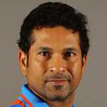

Sachin Ramesh Tendulkar AO BR (/ˌsʌtʃɪn tɛnˈduːlkər/ (listen); pronounced [sət͡ʃin t̪eːɳɖulkəɾ]; born 24 April 1973) is an Indian former international cricketer who captained the Indian national team. He is regarded as one of the greatest batsmen in the history of cricket.

Tendulkar took up cricket at the age of eleven, made his Test match debut on 15 November 1989 against Pakistan in Karachi at the age of sixteen, and went on to represent Mumbai domestically and India internationally for close to twenty-four years. In 2002, halfway through his career, Wisden ranked him the second-greatest Test batsman of all time, behind Don Bradman, and the second-greatest ODI batsman of all time, behind Viv Richards.[5] Later in his career, Tendulkar was part of the Indian team that won the 2011 Cricket World Cup, his first win in six World Cup appearances for India.[6] He had previously been named "Player of the Tournament" at the 2003 edition of the tournament. 
